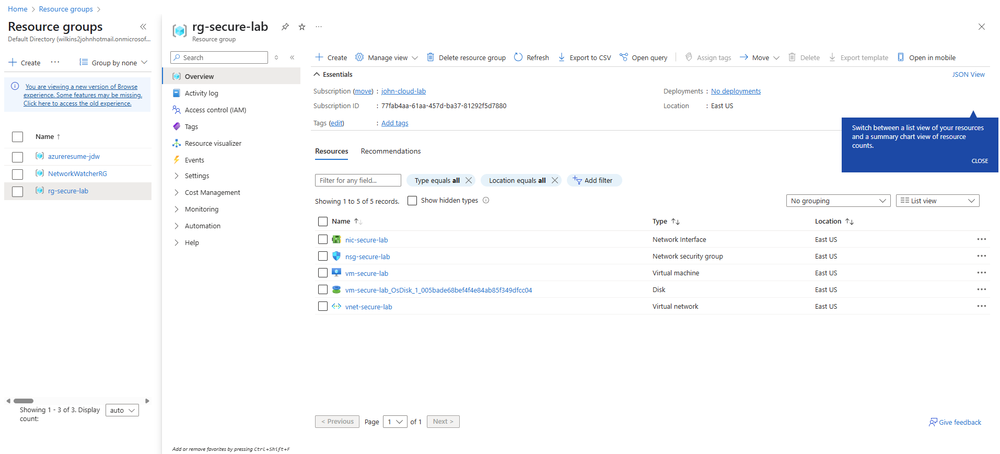

# azure-terraform-vm-vnet-nsg
# Azure VNet + VM + NSG Project (Terraform)

This project demonstrates how to deploy a secure Azure Virtual Network, a virtual machine, and a Network Security Group using Infrastructure as Code with Terraform.

## Key Skills Used
- Azure CLI
- Terraform
- Virtual Networks (vNets)
- Network Security Groups (NSGs)
- Virtual Machines (VMs)
- Infrastructure as Code (IaC)

## Why this matters
In real-world cloud roles, deploying secure and repeatable environments is critical. This project reflects job-ready skills such as Azure networking, secure access, and Terraform automation.

## Project Architecture
- vNet with custom subnet
- NSG with limited inbound access (e.g. SSH or RDP only from specific IPs)
- Linux or Windows VM deployed in subnet

---

## Deployed Resources

After running `terraform apply`, the following resources were successfully created in Azure:

- ✅ 1 x Resource Group (`rg-secure-lab`)
- ✅ 1 x Virtual Network with subnet
- ✅ 1 x Network Security Group (NSG)
- ✅ 1 x Network Interface (NIC)
- ✅ 1 x Linux Virtual Machine (`vm-secure-lab`)

---

## What I Learned

- How to build secure cloud environments using Terraform and Azure CLI
- Why Infrastructure as Code matters for repeatability and scale
- How NSGs work to control network access
- How to debug real-world issues like Azure login errors, tenant mismatches, and CLI auth
- How to organize cloud project files (main.tf, variables.tf, terraform.tfvars) the right way

---

## Next Steps (Future Projects)

- ✅ Add a Public IP and test remote access
- 🔐 Replace hardcoded credentials with Azure Key Vault
- 🔁 Automate this with GitHub Actions CI/CD
- 🔍 Add monitoring with Azure Monitor and Log Analytics
- 🧪 Begin hands-on projects aligned with the AZ-104 + Cloud+ exams
